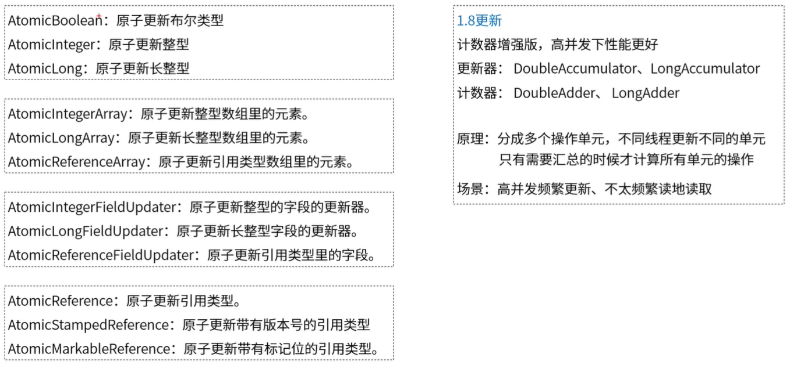
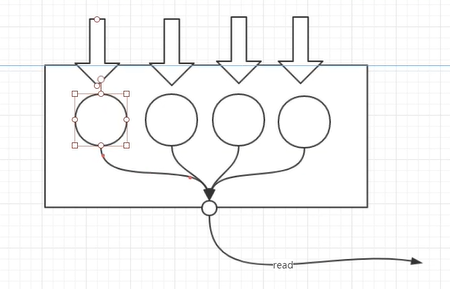

[TOC]

### 1 什么是 JUC 原子操作封装类

- 原子操作封装类是 JUCA（java.util.concurrent.atomic）包下的类的总称
- 都是基于 CAS(compare and swap) 实现的
- 它可以将**单个变量**的**赋值**操作封装成**原子性**操作

### 2 JUCA 的应用场景

- **多线程**下，不使用**锁**，实现**单个变量**的**赋值**操作

### 3 锁与 JUCA 的选择问题

- **极其高**的并发下，可能有许多线程一直做循环 CAS，导致 CPU **无效使用率**太高，进一步导致赋值操作效率越来越低
  - 一个线程设置完，其它线程如果都读取到旧值，后面争取 CPU 和比较操作都是无意义的消耗，并且一个线程可能有**好多次的这种无意义的消耗**
  - 而如果使用锁，就不存在读取旧值、比较操作的 CPU 消耗，只有加锁/释放锁的消耗，并且**只有固定次数的锁消耗**
- 上面说的**极其高**也没有一个具体的说法，并且随着 synchornized 锁的不断优化，原生锁的性能也会越来越高
- 只是 JUCA 包下的类使用会更简洁，并不一定性能就高
- 具体场景可以综合测试最后做出选择，**一般没必要纠结**，最赋值操作就简单的选择 JUCA 

### 4 为什么使用 JUCA 

- 提供了**多线程**下**单个变量赋值**的**原子性**操作
- 使用简单

### 5 JUCA 源码分析

#### 5.1 原子操作类总纲



#### 5.2 Atomic 类

- Atomic 类有三种子类，分别代表原子更新的布尔类型、整型、长整型
- **AtomicBoolean 方法解析**：6个方法
  - 内部通过 volatile int **value** 属性的 CAS 操作实现原子性操作
  - 可见 Boolean 属性最终转换为 int 属性来处理了

```java
AtomicBoolean ab = new AtomicBoolean(true);

ab.compareAndSet(true,false);		//比较然后赋值，如果旧值为 true，就设置为 false，设置成功才返回 true，否则返回 false，单个 CAS 就结束
ab.weakCompareAndSet(true,false);	//目前和 compareAndSet 方法一模一样
ab.get();			   			  //获取最新的值（因为有 volatile 修饰）

ab.getAndSet(true);		//循环 CAS 获取最新的值，并赋为 true
ab.lazySet(false);		//内部调用unsafe.putOrderedInt() 方法，这个是普通的设置int，值未必立刻回写到主存
ab.set(true);			//立即set，因为内部的 value 属性被 volatile 修饰
```

- **AtomicInteger 方法解析**：16个方法
  - 内部通过 volatile int **value** 属性的 CAS 操作实现原子性操作
  - 相比**AtomicBoolean**类，多了很多赋值方法

```java
AtomicInteger ai = new AtomicInteger(0);

ai.getAndIncrement();		//获取旧值，并加1，内部 CAS 循环加1，直到成功
ai.incrementAndGet();		//加1，并获取新值，内部 CAS 循环加1，直到成功

ai.getAndDecrement();		//获取旧值，并减1，内部 CAS 循环减1，直到成功
ai.decrementAndGet();		//减1，并获取新值，内部 CAS 循环减1，直到成功

ai.getAndAdd(2);		    //获取旧值，并加2，内部 CAS 循环加2，直到成功
ai.addAndGet(2);		    //加2，并获取新值，内部 CAS 循环加2，直到成功

ai.getAndAccumulate(6,Math::max);	//循环 CAS 设置 二元运算后的值。二值运算的第一位是获取到的最新值，第二位是设置的值（6）
ai.accumulateAndGet(4,(x,y)->{	    //和上面的区别只是，最后返回的值是 二元运算后的值
    return x+y;
});

ai.getAndUpdate(Math::abs);			//循环 CAS 设置 一元运算后的值，获取的是旧值
ai.updateAndGet((x)->{			    //循环 CAS 设置 一元运算后的值，获取的是新值
    return x*x;
});

ai.get();					    //获取最新的值（因为有 volatile 修饰）
ai.getAndSet(2);			     //循环 CAS 获取最新的值，并设置属性为2

ai.set(3);						//设置属性为2
ai.compareAndSet(1,2);		 	 //如果属性为1，则设置为2。成功返回 true。否则返回 false
ai.lazySet(3);					//ab.lazySet(false）
ai.weakCompareAndSet(3,3);		 //目前和 compareAndSet() 方法一样
```

- **AtomicLong 方法解析**：和 AtomicInteger 方法一模一样，只是 value 的属性从 int 变成了 long

#### 5.3 AtomicArray 类

- 实现**数组中元素**的原子性更新操作

- AtomicArray 类内部维护一个 final 修饰的 array 数组
  - array 数组并没有被 volatile 修饰
  - 即使数组被 volatile 修饰，只是数组的引用可见，数组的内部元素并不可见
  - 通过 unsafe.getIntVolatile(..) 方法**保证 array 元素的可见性**的
- 其余的方法和 Atomic 类是一样的，只是所有方法都多了一个 index 属性，表明操作数组的哪一位
- AtomicReferenceArray：原子更新的是引用类型的引用（即只能引用重新指向），而不是引用类型内部的值

#### 5.4 AtomicFieldUpdater 类

- 实现**目标类中的字段**的原子性更新操作

- AtomicFieldUpdater 类内部维护一个 final 修饰的 offset 变量（通过反射得到类中 filed 属性对应的偏移量）
- 通过偏移量，使用 CAS 来实现原子操作，操作和 Atomic 类一样
- **目标类中的对应字段必须被 volatile 修饰，且不能被 private 修饰**

```java
//这个 Target 是 age 字段必须被 volatile int 修饰，且不能被 private 修饰
AtomicIntegerFieldUpdater AIFU = AtomicIntegerFieldUpdater.newUpdater(Target.class,"age");
Target target = new Target("wk",24);
aifu.accumulateAndGet(target,56,(x,y)->{
    return x+y;
});
System.out.println(aiuf.getAge());

//这个 Target 是 time 字段必须被 volatile long 修饰，且不能被 private 修饰
AtomicLongFieldUpdater ALFU = AtomicLongFieldUpdater.newUpdater(Target.class,"time");

//这个 Target 是 man 的字段必须是 man.class 类，并且 Target 中的该字段必须被 volatile 修饰，并且不能被 private 修饰
AtomicReferenceFieldUpdater ARFU = AtomicReferenceFieldUpdater.newUpdater(Target.class,man.class,"man");
```

#### 5.5 AtomicReference 类

- **AtomicReference 方法解析**：10个方法
  - 和 AtomicInteger 类似，只是这个原子更新的是引用类型的引用地址

```java
AtomicReference ar = new AtomicReference();
System.out.println(ar.get());//null
ar.compareAndSet(null,"string");
System.out.println(ar.get());//string

AtomicFieldUpdater.aiuf a = new AtomicFieldUpdater.aiuf("wk",22);
AtomicFieldUpdater.aiuf b = new AtomicFieldUpdater.aiuf("wkk",222);
//注意：ar1.get() 变掉了
AtomicReference ar1 = new AtomicReference(a);
System.out.println(ar1.get());//aiuf{name='wk', age=22, man=null}
ar1.compareAndSet(a,b);
System.out.println(ar1.get());//aiuf{name='wkk', age=222, man=null}
```

- **AtomicStampedReference 方法解析**：

```java
AtomicFieldUpdater.aiuf a = new AtomicFieldUpdater.aiuf("wk",22);
AtomicFieldUpdater.aiuf b = new AtomicFieldUpdater.aiuf("wkk",222);
AtomicStampedReference asr = new AtomicStampedReference(a,0);
boolean flag = asr.attemptStamp(a,1);  //如果引用是 a，且stamp没变，将 stamp 设置为1
System.out.println(flag);

asr.compareAndSet(a,b,1,2);//单个 CAS，如果是 a,1，那么设置为 b,2
int[] stampHolder = new int[1];//只是用来存储 stamp;
AtomicFieldUpdater.aiuf aa = (AtomicFieldUpdater.aiuf)asr.get(stampHolder);//这个 stampHolder 是get() 用来回调的。这样就相当于返回了 两个参数，引用和 stamp
System.out.println(aa);

asr.getReference();//获取引用，因为Pair类使用 volatile 修饰，且使用的是引用的赋值，所以 Pair 中的属性也是可见的
asr.getStamp();//同理

asr.set(a,2); //pair 是可见的，且是引用赋值，所以 引用的赋值时原子的

asr.weakCompareAndSet(a,b,2,3);//内部调用compareAndSet
```


#### 5.6 多操作单元 Atomic 类

- 多操作单元类：
  - 其他 Atomic 类中更新的只是一个变量
  - 多操作变量，更新的是多个变量，最后取的时候再合并这多个变量
  - 这样就提高了 Atomic 类的**更新速度**(多个线程可以同时更新不同的单元)
  - 但是读取时，需要综合所有单元的值，所以适合**写多读少**的场景



- **DoubleAccumulator 方法解析**
  - 这个类操作的是 double 类型的数据，有4个方法
  - 源码过于难理解，并且获取的值还不准确，可能用于不精确的多更新操作吧

```java
DoubleAccumulator da = new DoubleAccumulator((x,y)->{
    return x*y;
},1.2);
//通过设定的值 1.2 和 3 做 二元操作符运算，得到新的设定值
da.accumulate(3);
//返回当前值。返回的值不是原子快照；在没有并发更新的情况下调用会返回准确的结果，但在计算值时发生的并发更新可能不会合并！-----------返回结果不准确！---------
da.get();
//重置 da 至原始状态，相对于重新 new 一个 da，但是只有没有并发更新的时候才有效，不然不准确，，，，，
da.reset();
//顾名思义
da.getThenReset();
```

- **LongAccumulator 方法解析**
  - 和 DoubleAccumulator 的区别仅仅在于返回值的类型变成了 long
- **DoubleAdder 方法解析**
  - 可以当作 DoubleAccumulator 的子类，它的 accumulator 为 二元相加运算符
  - 值也不准确
- **LongAdder 方法解析**
  - 可以当作 LongAccumulator 的子类，它的 accumulator 为 二元相加运算符
  - 值也不准确

### 6 CAS 浅析

#### 6.1 什么是 CAS 

- CAS 是 compare and swap 的简称，意为：**比较并替换**
- 执行 CAS 操作时，当且仅当内存地址 V 的值与预期值 A 相同时，将内存地址 V 的值修改为 B，否则就什么都不做。整个比较过程是原子性操作

#### 6.2 CAS 的应用场景

- 大量用于 JUCA 包中，来做原子性更新变量的操作
- 对单个变量做原子性更新的操作

#### 6.3 为什么要用 CAS

- 通过 CAS 可以实现**无锁同步**，避免锁带了的消耗（当然也存在一些问题）

#### 6.4 CAS 原理介绍

- 通过 AtomicInteger 类源码来理解 CAS

```java
AtomicInteger ai = new AtomicInteger(0);
ai.getAndIncrement();//获取并是 ai 值加 1
public final int getAndIncrement() {
    //this 的作用是传入 ai 对象的地址、valueOffset 的作用是传入 ai 对象中 value 变量的地址偏移量、1 为要增加的值
    return unsafe.getAndAddInt(this, valueOffset, 1);
}
public final int getAndAddInt(Object var1, long var2, int var4) {
    int var5;
    //这里使用了 循环 CAS 的方式，一直到 CAS 成功才返回！
    do {
        //通过 ai 对象的地址和地址偏移量(value 变量相对于对象地址的偏移量)，得到当前 value 变量的实际地址的值
        var5 = this.getIntVolatile(var1, var2);
        //比较 (var1,var2)、var5 -- 如果 var1 地址对应的 var2 偏移量地址的值 和 var5 相同，就将 value 变量所在地址的值替换为 var4+ var5，即原始的值+1
    } while(!this.compareAndSwapInt(var1, var2, var5, var5 + var4));
    return var5;
}
public final native boolean compareAndSwapInt(Object var1, long var2, int var4, int var5);

```

- 以上代码是循环 CAS 操作，单纯的 CAS 只有两个步骤
  - 步骤1：获取偏移量地址的值，作为预期值
  - 步骤2：比较偏移量地址的值(这时该地址的值可能已被别的线程修改了)和预期值，如果相等将该地址的值设置为 更新值，设置成功返回 true，否则返回 false
- 通过以上代码可以看出，CAS 需要 4 个参数：对象地址、偏移量、预期值、更新值
- 如果对象地址对应的偏移量地址的值 和 预期值相同，就将这个 **偏移量地址的值** 设置为 更新值

#### 6.5 CAS 存在的问题

- 如果要用 循环 CAS 来代替加锁操作，可能要循环很久才会成功

- 只能对一个变量进行操作，如果要对多个变量操作，必须要加锁

- ABA 问题
#### 6.6 ABA 问题

  - **场景1**

  ```java
  - 有一个变量 p = 4
  - 线程1 通过步骤1读取了 p 的预期值 4
  - 线程2 通过步骤1读取了 p 的预期值4，并通过步骤2成功将其设置成9
  - 线程3 通过步骤1读取了 p 的预期值9，并通过步骤2成功将其设置成4
  - 线程1 通过步骤2成功将其设置成了21
  //虽然这里线程1成功 CAS 了，但是我们真实意图其实线程1应该 CAS 失败的
  //因为步骤2成功的标准是 p 的值没有变，没有变真正含义，应该是没有变动
  //而 p 的值虽然最终没有变，但它变动了
  ```