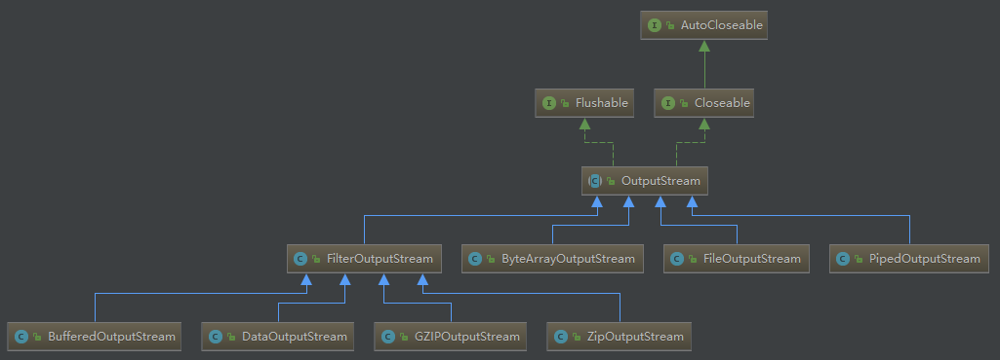

[TOC]

- 在 [Java InputStream 浅析](Java InputStream 浅析.md) 一文中，介绍了 InputStream 相关的知识
- 本文将简要介绍 Java 中的 OutputStream 类体系结构

## 1 OutputStream 子类结构

- 如 InputStream 一样，OutputStream 也是一个典型的装饰者模式的示例
- 它的体系结构和 InputStream 很是相似
- OutputStream 比 InputStream 多继承一个 Flushable 接口，用于将缓冲输出写入 underlying stream



### 1.1 OutputStream 源码分析

```java
public abstract class OutputStream implements Closeable, Flushable {
    //提供模板方法，供子类实现
    public abstract void write(int b) throws IOException;
    //内部使用，抽象类，自动扩展子类的实现功能
    public void write(byte b[]) throws IOException {
        write(b, 0, b.length);
    }
    //同上
    public void write(byte b[], int off, int len) throws IOException {...}
    //空实现，交给子类实现，用于实现缓存的输出流
    public void flush() throws IOException {}
    //空实现，交给子类实现
    public void close() throws IOException {}
}
```

## 2 OutputStream 具体实现类源码分析

### 2.1 ByteArrayOutputStream —— 字节输出流

- 核心参数：
  - buf[]：存储输出字节的地方，可以自动扩容
  - count：buf[] 数组，有效内容的最大下标
- 核心方法：
  - write(int b)：将 int 类型 b 的 低 8 位 存入字节数组中

```java
public class ByteArrayOutputStream extends OutputStream {

    protected byte buf[];
	//缓存有效数量
    protected int count;
    
    public synchronized void write(int b) {
        ensureCapacity(count + 1);
        buf[count] = (byte) b;
        count += 1;
    }
    //将 b[] 字节数组，放入字节流中
    public synchronized void write(byte b[], int off, int len) {
        if ((off < 0) || (off > b.length) || (len < 0) ||
            ((off + len) - b.length > 0)) {
            throw new IndexOutOfBoundsException();
        }
        ensureCapacity(count + len);
        System.arraycopy(b, off, buf, count, len);
        count += len;
    }
    //内部调用 out 的 write 方法
    public synchronized void writeTo(OutputStream out) throws IOException {
        out.write(buf, 0, count);
    }
    //通过 count = 0，实现 reset 方法
    public synchronized void reset() {count = 0;}
    //通过本输出流，创建一个 字节数组
    public synchronized byte toByteArray()[] {
        return Arrays.copyOf(buf, count);
    }
    //即是将字节数组，创建为字符串,通过平台默认的编码方式
    public synchronized String toString() {
        return new String(buf, 0, count);
    }
    //即是将字节数组，创建为字符串,通过指定的编码方式
    public synchronized String toString(String charsetName) {
        return new String(buf, 0, count, charsetName);
    }
    //字节数组流，不需要 close
    public void close() throws IOException {
    }
}
```

### 2.2 FileOutputStream —— 文件输出流

- 核心参数：
  - append：是否为 append 模式
  - path：文件路径
- 核心方法：
  - write(int b, boolean append)：写入一个字节到输出流
- 没有实现 flush 方法

```java
public class FileOutputStream extends OutputStream {
    //平台相关 fd
    private final FileDescriptor fd;
    //如果 append 为 true,则输出流将以 append 方式加入 file 中，否则从 file 的开头开始写
    private final boolean append;
    //适配 java nio
    private FileChannel channel;
    //同 inputstream
    private final String path;
    private final Object closeLock = new Object();
    private volatile boolean closed = false;
    
    //
    public FileOutputStream(File file, boolean append) {
        String name = (file != null ? file.getPath() : null);
        SecurityManager security = System.getSecurityManager();
        if (security != null) {
            security.checkWrite(name);
        }
        if (name == null) {
            throw new NullPointerException();
        }
        if (file.isInvalid()) {
            throw new FileNotFoundException("Invalid file path");
        }
        this.fd = new FileDescriptor();
        fd.attach(this);
        this.append = append;
        this.path = name;
        open(name, append);
    }
    //通过文件名打开文件
    private native void open0(String name, boolean append) throws FileNotFoundException;
    //往文件输出流中写入 一个 字节
    private native void write(int b, boolean append) throws IOException;
    //将 b[] 数组的 off-len 写入输出流
    private native void writeBytes(byte b[], int off, int len, boolean append) throws IOException;
    //关闭输出流
    public void close() throws IOException {
        synchronized (closeLock) {
            if (closed) {
                return;
            }
            closed = true;
        }

        if (channel != null) {
            channel.close();
        }

        fd.closeAll(new Closeable() {
            public void close() throws IOException {
               close0();
           }
        });
    }
}
```

### 2.3 PipedOutputStream —— 管道输出流

- 核心参数：sink，内部依赖输入流
- 核心方法：connect(PipedInputStream snk)，传入一个输入流

```java
public class PipedOutputStream extends OutputStream {
    private PipedInputStream sink;
    //一个 PipedOutputStream，必须对应一个 PipedInputStream
    public synchronized void connect(PipedInputStream snk) throws IOException {
        if (snk == null) {
            throw new NullPointerException();
        } else if (sink != null || snk.connected) {
            throw new IOException("Already connected");
        }
        sink = snk;
        snk.in = -1;
        snk.out = 0;
        snk.connected = true;
    }
    //内部之间将输出流，输出到输入流中
    public void write(int b)  throws IOException {
        if (sink == null) {
            throw new IOException("Pipe not connected");
        }
        sink.receive(b);
    }
    public synchronized void flush() throws IOException {
        if (sink != null) {
            synchronized (sink) {
                sink.notifyAll();//开启所有输入流读取
            }
        }
    }
    public void close()  throws IOException {
        if (sink != null) {
            sink.receivedLast();
        }
    }
}
```

### 2.4 SocketOutputStream —— 网络输出流

```java
class SocketOutputStream extends FileOutputStream {
    private AbstractPlainSocketImpl impl = null;
    private byte temp[] = new byte[1];
    private Socket socket = null;
    //从 impl 中得到 socket，并通过 impl 打开一个 fd
    SocketOutputStream(AbstractPlainSocketImpl impl) throws IOException {
        super(impl.getFileDescriptor());
        this.impl = impl;
        socket = impl.getSocket();
    }
    //写字节入 socket 
    private native void socketWrite0(FileDescriptor fd, byte[] b, int off,
                                     int len) throws IOException;
    //关闭 socket
    public void close() throws IOException {
        // Prevent recursion. See BugId 4484411
        if (closing)
            return;
        closing = true;
        if (socket != null) {
            if (!socket.isClosed())
                socket.close();
        } else
            impl.close();
        closing = false;
    }
}
```

### 2.5 ObjectOutputStream —— 序列化输出流

- 留待以后分析

## 3 OutputStream 装饰类源码分析

### 3.1 BufferedOutputStream —— 缓冲输出流

- 核心参数：
  - buf[]：最为缓冲区
  - count：缓冲区的已缓存下标
- 核心方法：
  - flushBuffer：刷空缓冲区
  - write：向缓冲区写字节

```java
public class BufferedOutputStream extends FilterOutputStream {
    protected byte buf[];
    protected int count;//目前输出缓冲数组的下标
    public BufferedOutputStream(OutputStream out, int size) {
        super(out);
        if (size <= 0) {
            throw new IllegalArgumentException("Buffer size <= 0");
        }
        buf = new byte[size];
    }
    //将 buf[] 中的字节全部刷入 输出流
    private void flushBuffer() throws IOException {
        if (count > 0) {
            out.write(buf, 0, count);
            count = 0;
        }
    }
    //如果 buf[] 满了，将 buf[] 中的字节全部刷入输出流，并将新的字节加入 buf[]
    public synchronized void write(int b) throws IOException {
        if (count >= buf.length) {
            flushBuffer();
        }
        buf[count++] = (byte)b;
    }
    //先刷空 buf，再刷 实际输出流
    public synchronized void flush() throws IOException {
        flushBuffer();
        out.flush();
    }
}
```

### 3.2 DataOutputStream —— 基本类型序列化

```java
public class DataOutputStream extends FilterOutputStream implements DataOutput {
    //写入字节的个数，达到Integer.MAX_VALUE 时，将一直保持这个值
    protected int written;
    
    //主要就是序列化这些基本类型为 byte
    public final void writeBytes(String s) throws IOException {
        int len = s.length();
        for (int i = 0 ; i < len ; i++) {
            out.write((byte)s.charAt(i));
        }
        incCount(len);
    }
}
```

### 3.3 GZIPOutputStream

- 留待以后分析

### 3.4 ZIPOutputStream

- 留待以后分析