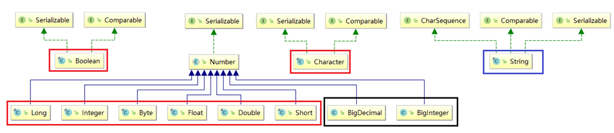

[TOC]

- 在任何一门语言中，**基础**类型的使用一定是最多的。熟练使用基础类型，可以使得代码更为精炼
- 本系列文章将系统性介绍 Java 中的基础类型

## 1 基础类型总览

| 基础类型类别     | 属性                                                         |
| ---------------- | ------------------------------------------------------------ |
| 8 种基本数据类型 | byte    short    char    int    float    double    boolean   |
| 对应的包装类型   | Byte    Short    Character    Integer    Float    Double    Boolean |
| String           | 它的默认值和其它引用类型一样 为 null                         |
| 大数据的计算     | BigInteger     BigDecimal                                    |

## 2 8 种基本数据类型

| 名称    | 字节                                                         | 取值范围                                                     | 默认值   |
| ------- | ------------------------------------------------------------ | ------------------------------------------------------------ | -------- |
| byte    | 1个字节                                                      | -128 ~127                                                    | 0        |
| short   | 2个字节                                                      | -32768 ~ 32767                                               | 0        |
| int     | 4个字节                                                      | -2^31^ ~ 2^31^-1 SE8以及之后,可以用int来表示无符号32位数 0~2^32^-1 | 0        |
| long    | 8个字节                                                      | -2^63^ ~ 2^63^-1 SE8以及之后,可以用long来表示无符号64位数0~2^64^-1 | 0L       |
| float   | 4个字节                                                      | 单精度 32-bit IEEE 754 浮点数                                | 0.0f     |
| double  | 8个字节                                                      | 双精度 64-bit IEEE 754 浮点数                                | 0.0d     |
| char    | 2个字节                                                      | 16位 Unicode 字符 '\u0000' (or 0)      ~   '\uffff' (65535 包括) | '\u0000' |
| boolean | 字节大小并未规定,由实现决定 虚拟机内部没有支持boolean的指令  boolean编译之后使用虚拟机中的int代替 oracle公司的虚拟机实现中boolean数组编码为byte数组 那就是一个boolean 一个字节 8位 | true 或者 false                                              | false    |

## 3 类层次结构

### 3.1 Number 类解析

- 待总结

### 3.2 Character 类解析

- 待总结

### 3.3 String 类解析

- 待总结

### 3.4 Boolean 类解析 

- 待总结

## 参考

jdk 1.8_u171

[基础类型概述](https://www.cnblogs.com/noteless/p/9697734.html)

[官网版本信息](https://docs.oracle.com/en/java/javase/index.html)

[java 8 总览](https://docs.oracle.com/javase/tutorial/index.html)

[Java Language and Virtual Machine Specifications](https://docs.oracle.com/javase/specs/index.html)