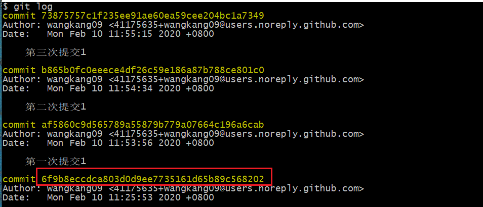
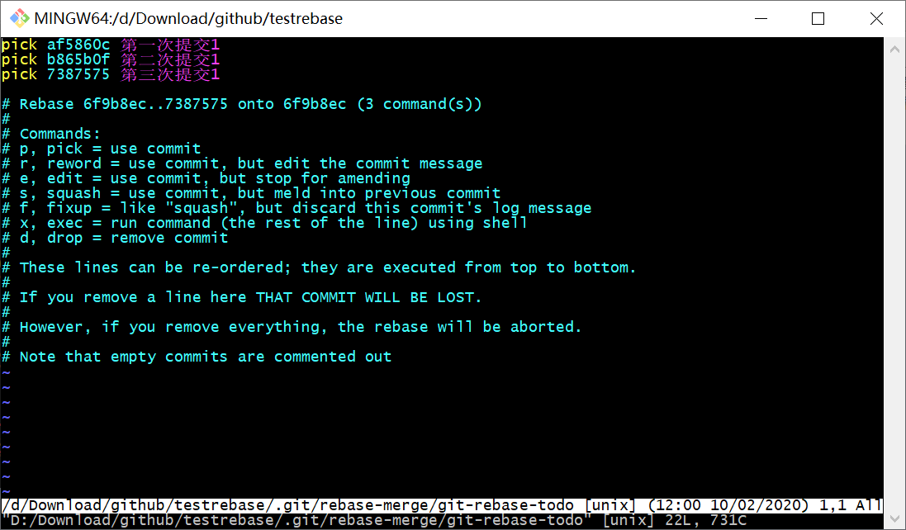
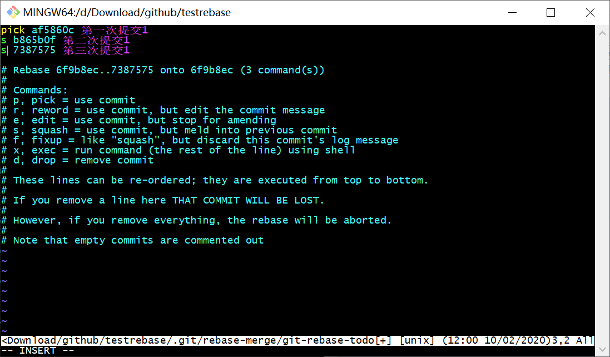
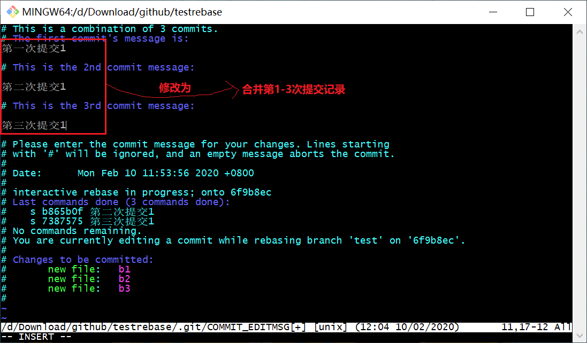
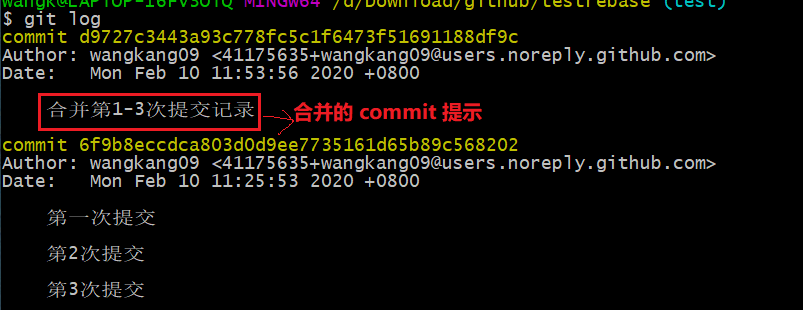
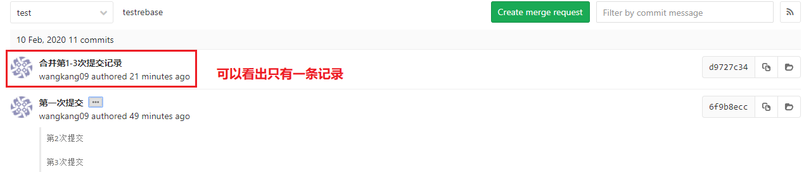
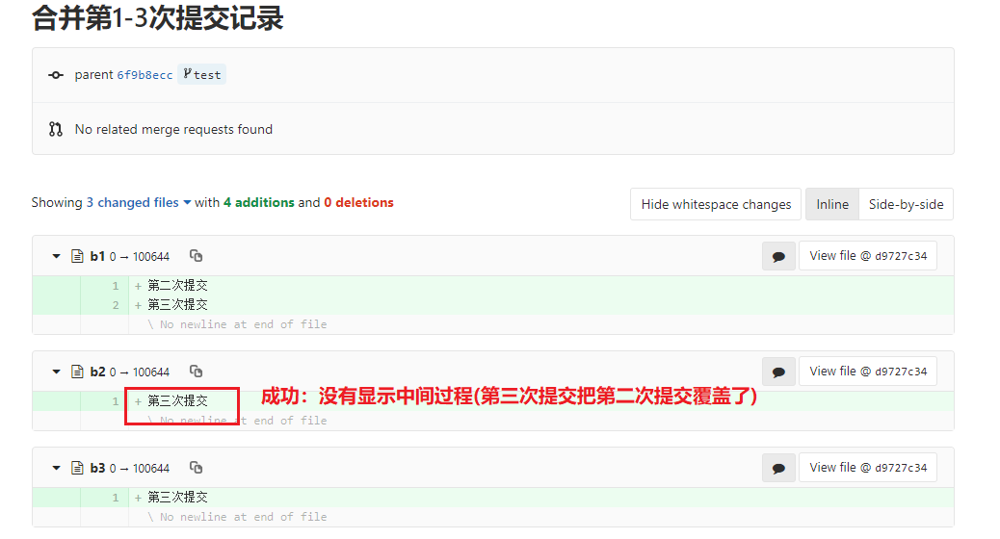
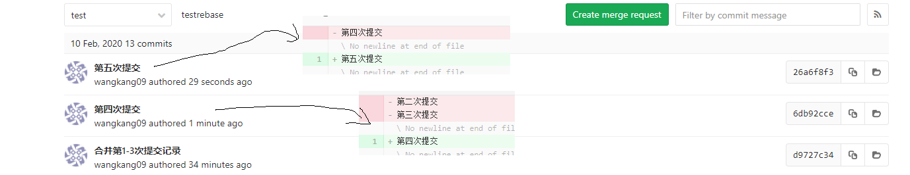
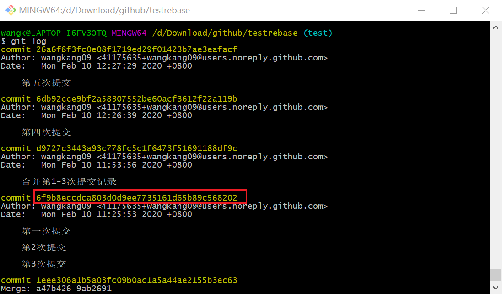

[TOC]

#### 1 为何要合并多次 commit

- 方便 code review：多次提交后的远程会有多条历史记录，并且极有可能中间的一条记录并不是最终的代码，导致 code review 时的混乱
- 合并多次 commit 后，只会形成一条历史记录，这条记录中的代码修改即是最终的修改，只需要 review 这一条记录中的代码修改，就可以清楚最终的代码逻辑

#### 2 导致多次 commit 的场景

- 自己做完一个功能后，觉得没问题后 commit，结果领导看完后说要修改某个小地方。这时修改后又会做一次 commit。而且很有可能不止一次打回重做，这样就会产生很多的 commit

#### 3 合并本地多次提交

##### 3.1 做3次提交



##### 3.2 开始合并

```git
//以下命令表示合并 6f9b8ecc 往后的 commit(不包括 6f9b8ecc)
git rebase -i 6f9b8ecc
```

**执行完命令出现以下界面**



**将 pick 改为 s 得到以下界面**



**修改完后保存退出得到以下界面**

- **可以合并 commit 提示**：可以是所有功能的介绍，方便他人理解
- 删除一下界面的原始提示，输入需要的提示



##### 3.3 rebase 完成后本地 log



- 对比上图和第一张图，可以看出 3 个 commit 记录成功变成了 1 个

##### 3.4 git push 后的远程 history






#### 4 合并远程多次提交1

##### 4.1 做2次远程提交



##### 4.2 合并远程提交

- 找到最新的不需要合并的 commitId
- 之后的流程和合并本地流程一样



##### 4.3 和合并本地提交最后的区别

- 由下图可以看出，合并远程多次提交，之前的远程提交记录还在。虽然仍然可以只看合并后的记录，但 code review 仍然不太方便


#### 5 合并远程多次提交2

- 如何使得合并远程多次提交，并 merge 到 master 分支后，master 分支只有一条合并历史记录呢？

##### 5.1 解决方案

- 只需在 4.2 的 rebase 命令前，将当前分支切换出一个新的分支
- 然后在这个新的分支上进行 rebase 命令(**这样就相当于合并本地 commit了**)，这样这个分支对应的远程分支也就一条记录了
- 最后将这新分支 merge 到 master 中


#### 参考

[git 几个commit点合并成一个commit点](https://blog.csdn.net/u013276277/article/details/82470177)