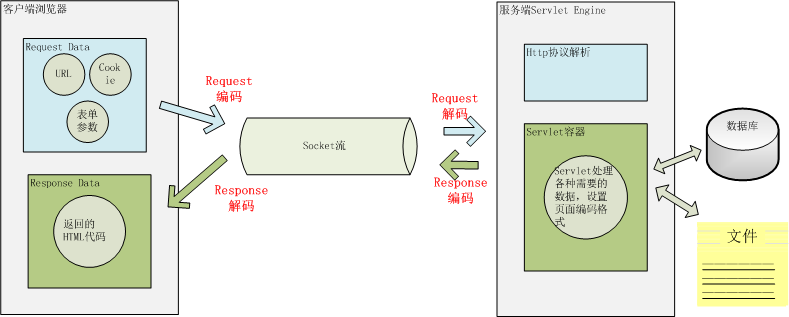
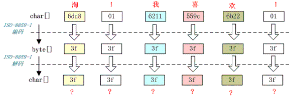
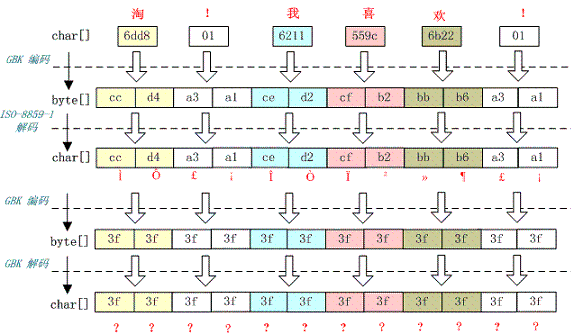
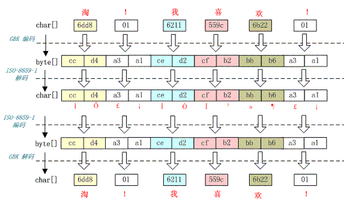

[TOC]

### 0 String 的构成

- String 内部由 char[] 构成
- **注：** string.getByte()：使用；平台默认的编码方式，将 utf-16 形式的 codeunit 编码成其他默认编码形式的 byte 数组来传输
- **注：** new String(str.getByte(),"UTF-8")：这种情况，如果默认编码不是 "UTF-8" 就会乱码
- **注：** 只有 new String(str.getByte(encoding),encoding)，这种情况才一定不会乱码
- **注：** 最关键的是 new String(bytes,encoding)：这时，bytes 是通过网络传过来的，这里的 encoding 必须是 bytes 对应的 编码方式，才不会乱码
- **注：** 本文提到关键词说明
  - BMP：unicode 字符集中的 第 0 平面，既，字符集对应的数值在 [0~0xFFFF] 上
  - 辅助平面：字符集对应的数值 [0x10000~0x10FFFF] 上
  - **code point：**unicode 字符集中字符对应的 **4 字节数值**
  - **code unit：**UTF-16 编码 code point 后的 **2 字节数值**，如果 code point 在 BMP 上，一个 code point 对应一个 code unit，如果在 **辅助平面** 上，一个 code point 对应 2 个 code unit
  - **字符：**表示 java 中的 char 元素，其实 char 说成字符是不准确的，真实的 char 是 UTF-16 的编码(code unit)
  - **unicode 字符：**表示 unicode 字符集中的字符，也既是真实看到的字符

### 1 String 构造函数

| 构造函数                                                     | 描述                                 | 补充                                                         |
| ------------------------------------------------------------ | ------------------------------------ | ------------------------------------------------------------ |
| [String](https://docs.oracle.com/javase/8/docs/api/java/lang/String.html#String-byte:A-)(byte[] bytes) | 创建一个字符串，使用平台默认 charset | 通过平台默认的 charset(一般为 UTF-8)将 bytes 解码为 UTF-16形式的 codeunit |
| [String](https://docs.oracle.com/javase/8/docs/api/java/lang/String.html#String-byte:A-java.nio.charset.Charset-)(byte[] bytes, [Charset](https://docs.oracle.com/javase/8/docs/api/java/nio/charset/Charset.html) charset) | 指定 charset                         |                                                              |
| [String](https://docs.oracle.com/javase/8/docs/api/java/lang/String.html#String-byte:A-int-int-java.nio.charset.Charset-)(byte[] bytes, int offset, int length, [Charset](https://docs.oracle.com/javase/8/docs/api/java/nio/charset/Charset.html) charset) | 指定 bytes 子序列                    |                                                              |
| [String](https://docs.oracle.com/javase/8/docs/api/java/lang/String.html#String-byte:A-java.lang.String-)(byte[] bytes, [String](https://docs.oracle.com/javase/8/docs/api/java/lang/String.html) charsetName) |                                      |                                                              |
| [String](https://docs.oracle.com/javase/8/docs/api/java/lang/String.html#String-byte:A-int-int-java.lang.String-)(byte[] bytes, int offset, int length, [String](https://docs.oracle.com/javase/8/docs/api/java/lang/String.html) charsetName) |                                      |                                                              |
| [String](https://docs.oracle.com/javase/8/docs/api/java/lang/String.html#String-char:A-)(char[] value) |                                      |                                                              |
| [String](https://docs.oracle.com/javase/8/docs/api/java/lang/String.html#String-char:A-int-int-)(char[] value, int offset, int count) |                                      |                                                              |
| [String](https://docs.oracle.com/javase/8/docs/api/java/lang/String.html#String-int:A-int-int-)(int[] codePoints, int offset, int count) |                                      | 将 unicode 的 codepoints 编码成 UTF-16 的 code unit 存储     |

### 2 String 方法

#### 2.1 indexOf/contains

| 返回类型 | 方法名                                                       | 描述                             | 补充                                              |
| -------- | ------------------------------------------------------------ | -------------------------------- | ------------------------------------------------- |
| int      | [indexOf](https://docs.oracle.com/javase/8/docs/api/java/lang/String.html#indexOf-int-)(int ch) | 第一个 code point 码为 ch 的下标 | 如果 ch 在辅助平面，返回的是 highSurrogate 的下标 |
| int      | [indexOf](https://docs.oracle.com/javase/8/docs/api/java/lang/String.html#indexOf-int-int-)(int ch, int fromIndex) | 从 fromIndex 开始的              |                                                   |
| int      | [indexOf](https://docs.oracle.com/javase/8/docs/api/java/lang/String.html#indexOf-java.lang.String-)([String](https://docs.oracle.com/javase/8/docs/api/java/lang/String.html) str) | 第一个 str 字符串 的位置         | 这个就是简单的内部 char[] 比较                    |
| int      | [indexOf](https://docs.oracle.com/javase/8/docs/api/java/lang/String.html#indexOf-java.lang.String-int-)([String](https://docs.oracle.com/javase/8/docs/api/java/lang/String.html) str, int fromIndex) | 从 fromIndex 开始的              |                                                   |
| int      | [lastIndexOf](https://docs.oracle.com/javase/8/docs/api/java/lang/String.html#lastIndexOf-int-)(int ch) | 最后一个                         | 如果 ch 在辅助平面，返回的是 highSurrogate 的下标 |
| int      | [lastIndexOf](https://docs.oracle.com/javase/8/docs/api/java/lang/String.html#lastIndexOf-int-int-)(int ch, int fromIndex) |                                  |                                                   |
| int      | [lastIndexOf](https://docs.oracle.com/javase/8/docs/api/java/lang/String.html#lastIndexOf-java.lang.String-)([String](https://docs.oracle.com/javase/8/docs/api/java/lang/String.html) str) |                                  |                                                   |
| int      | [lastIndexOf](https://docs.oracle.com/javase/8/docs/api/java/lang/String.html#lastIndexOf-java.lang.String-int-)([String](https://docs.oracle.com/javase/8/docs/api/java/lang/String.html) str, int fromIndex) |                                  |                                                   |
| boolean  | [contains](https://docs.oracle.com/javase/8/docs/api/java/lang/String.html#contains-java.lang.CharSequence-)([CharSequence](https://docs.oracle.com/javase/8/docs/api/java/lang/CharSequence.html) s) | 内部调用 indexOf(s.toString)     |                                                   |

#### 2.2 equals/length

| 返回类型 | 方法名                                                       | 描述             | 补充                                                |
| -------- | ------------------------------------------------------------ | ---------------- | --------------------------------------------------- |
| boolean  | [contentEquals](https://docs.oracle.com/javase/8/docs/api/java/lang/String.html#contentEquals-java.lang.CharSequence-)([CharSequence](https://docs.oracle.com/javase/8/docs/api/java/lang/CharSequence.html) cs) | 字符序列的比较   | 只要是字符序列，就可能返回 true                     |
| boolean  | [contentEquals](https://docs.oracle.com/javase/8/docs/api/java/lang/String.html#contentEquals-java.lang.StringBuffer-)([StringBuffer](https://docs.oracle.com/javase/8/docs/api/java/lang/StringBuffer.html) sb) | 内部调用 上面    |                                                     |
| boolean  | [equals](https://docs.oracle.com/javase/8/docs/api/java/lang/String.html#equals-java.lang.Object-)([Object](https://docs.oracle.com/javase/8/docs/api/java/lang/Object.html) anObject) | String 比较      | 只有 String 类型，才可能返回 true                   |
| int      | [length](https://docs.oracle.com/javase/8/docs/api/java/lang/String.html#length--)() | 返回字符串的长度 | 注：是 char[] 的长度，**可能比unicode字符的长度大** |

#### 2.3 compare/hashcode

| 返回类型 | 方法名                                                       | 描述                           |
| -------- | ------------------------------------------------------------ | ------------------------------ |
| int      | [compareTo](https://docs.oracle.com/javase/8/docs/api/java/lang/String.html#compareTo-java.lang.String-)([String](https://docs.oracle.com/javase/8/docs/api/java/lang/String.html) anotherString) | "b".compareTo("C") 返回 **31** |
| int      | [compareToIgnoreCase](https://docs.oracle.com/javase/8/docs/api/java/lang/String.html#compareToIgnoreCase-java.lang.String-)([String](https://docs.oracle.com/javase/8/docs/api/java/lang/String.html) str) | "b".compareTo("C") 返回 **-1** |
| int      | [hashCode](https://docs.oracle.com/javase/8/docs/api/java/lang/String.html#hashCode--)() |                                |

#### 2.4 charAt/codePoint

| 返回类型 | 方法名                                                       | 描述                                        | 补充                                                         |
| -------- | ------------------------------------------------------------ | ------------------------------------------- | ------------------------------------------------------------ |
| char     | [charAt](https://docs.oracle.com/javase/8/docs/api/java/lang/String.html#charAt-int-)(int index) | 返回字符串第 index 位置的**字符**           | value[index]                                                 |
| int      | [codePointAt](https://docs.oracle.com/javase/8/docs/api/java/lang/String.html#codePointAt-int-)(int index) | 返回字符串第 index 位置的**code point**     | 可能是一个 code unit 也可能是 两个 code unit 对应的 code point 值 |
| int      | [codePointBefore](https://docs.oracle.com/javase/8/docs/api/java/lang/String.html#codePointBefore-int-)(int index) | 返回 index 前一个位置的 **code point**      |                                                              |
| int      | [codePointCount](https://docs.oracle.com/javase/8/docs/api/java/lang/String.html#codePointCount-int-int-)(int beginIndex, int endIndex) | 返回字符串的子序列总共对应的 code point个数 | 匹配一个 surrogatePairs 总 count--，即，最后一个即使是 highSurrogate 也直接视为一个 code point |

#### 2.5 valueOf

| 返回类型      | 方法名                                                       | 描述                                                         |
| ------------- | ------------------------------------------------------------ | ------------------------------------------------------------ |
| static String | [copyValueOf](https://docs.oracle.com/javase/8/docs/api/java/lang/String.html#copyValueOf-char:A-)(char[] data) | 内部调用 [String](https://docs.oracle.com/javase/8/docs/api/java/lang/String.html#String-char:A-)(char[] value) |
| static String | [copyValueOf](https://docs.oracle.com/javase/8/docs/api/java/lang/String.html#copyValueOf-char:A-int-int-)(char[] data, int offset, int count) | 内部调用 [String](https://docs.oracle.com/javase/8/docs/api/java/lang/String.html#String-char:A-int-int-)(char[] value, int offset, int count) |
| static String | [valueOf](https://docs.oracle.com/javase/8/docs/api/java/lang/String.html#valueOf-java.lang.Object-)([Object](https://docs.oracle.com/javase/8/docs/api/java/lang/Object.html) obj) | 内部调用 obj.toString() 方法                                 |
| static String | [valueOf](https://docs.oracle.com/javase/8/docs/api/java/lang/String.html#valueOf-long-)(long l) | 内部调用 Long.toString(l)                                    |
| static String | [valueOf](https://docs.oracle.com/javase/8/docs/api/java/lang/String.html#valueOf-long-)(基本类型) | 内部调用 包装类.toString(基本类型)                           |
| static String | [valueOf](https://docs.oracle.com/javase/8/docs/api/java/lang/String.html#valueOf-boolean-)(boolean b) | return b ? "true" : "false"                                  |

#### 2.6 getBytes/toCharArray

| 返回类型 | 方法名                                                       | 描述                             | 补充                                                       |
| -------- | ------------------------------------------------------------ | -------------------------------- | ---------------------------------------------------------- |
| byte[]   | [getBytes](https://docs.oracle.com/javase/8/docs/api/java/lang/String.html#getBytes--)() | 根据平台默认 charset 编码 字符串 | 将 UTF-16 的 code unit 编码成编码 编码的字节形式，用来传输 |
| byte[]   | [getBytes](https://docs.oracle.com/javase/8/docs/api/java/lang/String.html#getBytes-java.nio.charset.Charset-)([Charset](https://docs.oracle.com/javase/8/docs/api/java/nio/charset/Charset.html) charset) | 根据指定 charset 编码 字符串     |                                                            |
| byte[]   | [getBytes](https://docs.oracle.com/javase/8/docs/api/java/lang/String.html#getBytes-java.lang.String-)([String](https://docs.oracle.com/javase/8/docs/api/java/lang/String.html) charsetName) | 同上                             |                                                            |
| void     | [getChars](https://docs.oracle.com/javase/8/docs/api/java/lang/String.html#getChars-int-int-char:A-int-)(int srcBegin, int srcEnd, char[] dst, int dstBegin) | 将字符串 copy 到 char[] dst 中   |                                                            |
| byte[]   | [toCharArray](https://docs.oracle.com/javase/8/docs/api/java/lang/String.html#toCharArray--)() | 原理同上                         | 只是没有指定范围                                           |

#### 2.7 replace/toString

| 返回类型 | 方法名                                                       | 描述                              |
| -------- | ------------------------------------------------------------ | --------------------------------- |
| String   | [replace](https://docs.oracle.com/javase/8/docs/api/java/lang/String.html#replace-char-char-)(char oldChar, char newChar) | 简单的将 字符 替换                |
| String   | [replace](https://docs.oracle.com/javase/8/docs/api/java/lang/String.html#replace-java.lang.CharSequence-java.lang.CharSequence-)([CharSequence](https://docs.oracle.com/javase/8/docs/api/java/lang/CharSequence.html) target, [CharSequence](https://docs.oracle.com/javase/8/docs/api/java/lang/CharSequence.html) replacement) | 替换 字符串："aaa"->"ba"          |
| String   | [replaceAll](https://docs.oracle.com/javase/8/docs/api/java/lang/String.html#replaceAll-java.lang.String-java.lang.String-)([String](https://docs.oracle.com/javase/8/docs/api/java/lang/String.html) regex, [String](https://docs.oracle.com/javase/8/docs/api/java/lang/String.html) replacement) | 替换所有匹配 regex 规则的字符串   |
| String   | [replaceFirst](https://docs.oracle.com/javase/8/docs/api/java/lang/String.html#replaceFirst-java.lang.String-java.lang.String-)([String](https://docs.oracle.com/javase/8/docs/api/java/lang/String.html) regex, [String](https://docs.oracle.com/javase/8/docs/api/java/lang/String.html) replacement) | 替换第一个匹配 regex 规则的字符串 |
| String   | [toString](https://docs.oracle.com/javase/8/docs/api/java/lang/String.html#toString--)() | 返回 this                         |


#### 2.8 match

| 返回类型 | 方法名                                                       | 描述                                                         |
| -------- | ------------------------------------------------------------ | ------------------------------------------------------------ |
| boolean  | [matches](https://docs.oracle.com/javase/8/docs/api/java/lang/String.html#matches-java.lang.String-)([String](https://docs.oracle.com/javase/8/docs/api/java/lang/String.html) regex) | 字符串是否能够匹配 regex 规则                                |
| boolean  | [regionMatches](https://docs.oracle.com/javase/8/docs/api/java/lang/String.html#regionMatches-boolean-int-java.lang.String-int-int-)(boolean ignoreCase, int toffset, [String](https://docs.oracle.com/javase/8/docs/api/java/lang/String.html) other, int ooffset, int len) | ignoreCase：区分大小写                                       |
| boolean  | [regionMatches](https://docs.oracle.com/javase/8/docs/api/java/lang/String.html#regionMatches-int-java.lang.String-int-int-)(int toffset, [String](https://docs.oracle.com/javase/8/docs/api/java/lang/String.html) other, int ooffset, int len) | toffset：this 比较的偏移；other：比较的字符串；ooffset：other 的偏移；len：比较的长度 |


#### 2.9 start/endsWith

| 返回类型 | 方法名                                                       | 描述                                                         |
| -------- | ------------------------------------------------------------ | ------------------------------------------------------------ |
| boolean  | [endsWith](https://docs.oracle.com/javase/8/docs/api/java/lang/String.html#endsWith-java.lang.String-)([String](https://docs.oracle.com/javase/8/docs/api/java/lang/String.html) suffix) | 以偏移量为 value.length - suffix.value.length 的 suffix 开头，如果这个方法加偏移量就需要取得子字符串了 |
| boolean  | [startsWith](https://docs.oracle.com/javase/8/docs/api/java/lang/String.html#startsWith-java.lang.String-)([String](https://docs.oracle.com/javase/8/docs/api/java/lang/String.html) prefix) | 字符串是否已 prefix 开头                                     |
| boolean  | [startsWith](https://docs.oracle.com/javase/8/docs/api/java/lang/String.html#startsWith-java.lang.String-int-)([String](https://docs.oracle.com/javase/8/docs/api/java/lang/String.html) prefix, int toffset) | 加偏移量                                                     |


#### 2.10 substring/subSequence

| 返回类型     | 方法名                                                       | 描述                                  |
| ------------ | ------------------------------------------------------------ | ------------------------------------- |
| String       | [substring](https://docs.oracle.com/javase/8/docs/api/java/lang/String.html#substring-int-)(int beginIndex) | new String(value, beginIndex, subLen) |
| String       | [substring](https://docs.oracle.com/javase/8/docs/api/java/lang/String.html#substring-int-int-)(int beginIndex, int endIndex) | 加偏移量                              |
| charSequence | [subSequence](https://docs.oracle.com/javase/8/docs/api/java/lang/String.html#subSequence-int-int-)(int beginIndex, int endIndex) | 调用上面方法                          |


#### 2.11 toXXXCase/concat

| 返回类型 | 方法名                                                       | 描述                                                         |
| -------- | ------------------------------------------------------------ | ------------------------------------------------------------ |
| String   | [toLowerCase](https://docs.oracle.com/javase/8/docs/api/java/lang/String.html#toLowerCase--)() | 返回小写                                                     |
| String   | [toLowerCase](https://docs.oracle.com/javase/8/docs/api/java/lang/String.html#toLowerCase-java.util.Locale-)([Locale](https://docs.oracle.com/javase/8/docs/api/java/util/Locale.html) locale) | `"TITLE".toLowerCase()` in a Turkish locale returns `"t\u0131tle"`, where '\u0131' is the LATIN SMALL LETTER DOTLESS I character. To obtain correct results for locale insensitive strings, use `toLowerCase(Locale.ROOT)` |
| String   | [toUpperCase](https://docs.oracle.com/javase/8/docs/api/java/lang/String.html#toUpperCase--)() | 返回大写                                                     |
| String   | [toUpperCase](https://docs.oracle.com/javase/8/docs/api/java/lang/String.html#toUpperCase-java.util.Locale-)([Locale](https://docs.oracle.com/javase/8/docs/api/java/util/Locale.html) locale) |                                                              |
| String   | [concat](https://docs.oracle.com/javase/8/docs/api/java/lang/String.html#concat-java.lang.String-)([String](https://docs.oracle.com/javase/8/docs/api/java/lang/String.html) str) | 拼接字符串                                                   |


#### 2.12 format/trim

| 返回类型      | 方法名                                                       | 描述                                                         |
| ------------- | ------------------------------------------------------------ | ------------------------------------------------------------ |
| static String | [format](https://docs.oracle.com/javase/8/docs/api/java/lang/String.html#format-java.util.Locale-java.lang.String-java.lang.Object...-)([Locale](https://docs.oracle.com/javase/8/docs/api/java/util/Locale.html) l, [String](https://docs.oracle.com/javase/8/docs/api/java/lang/String.html) format, [Object](https://docs.oracle.com/javase/8/docs/api/java/lang/Object.html)... args) | System.out.printf("我是%s，今年 %d 了", "王康",25);          |
| static String | [format](https://docs.oracle.com/javase/8/docs/api/java/lang/String.html#format-java.lang.String-java.lang.Object...-)([String](https://docs.oracle.com/javase/8/docs/api/java/lang/String.html) format, [Object](https://docs.oracle.com/javase/8/docs/api/java/lang/Object.html)... args) | [示例](https://blog.csdn.net/anita9999/article/details/82346552) |
| String        | [trim](https://docs.oracle.com/javase/8/docs/api/java/lang/String.html#trim--)() |                                                              |


#### 2.13 split/isEmpty

| 返回类型 | 方法名                                                       | 描述                                                    |
| -------- | ------------------------------------------------------------ | ------------------------------------------------------- |
| String[] | [split](https://docs.oracle.com/javase/8/docs/api/java/lang/String.html#split-java.lang.String-)([String](https://docs.oracle.com/javase/8/docs/api/java/lang/String.html) regex) | 切分字符串，按照指定的 regex                            |
| String[] | split(String regex, int limit)                               | 返回数组限定在 Limit 大小，如果limit 大，则添加空字符串 |
| boolean  | [isEmpty](https://docs.oracle.com/javase/8/docs/api/java/lang/String.html#isEmpty--)() | value.length == 0                                       |


#### 2.13 join/intern

| 返回类型      | 方法名                                                       | 描述                                                         | 补充                                   |
| ------------- | ------------------------------------------------------------ | ------------------------------------------------------------ | -------------------------------------- |
| static String | [join](https://docs.oracle.com/javase/8/docs/api/java/lang/String.html#join-java.lang.CharSequence-java.lang.CharSequence...-)([CharSequence](https://docs.oracle.com/javase/8/docs/api/java/lang/CharSequence.html) delimiter, [CharSequence](https://docs.oracle.com/javase/8/docs/api/java/lang/CharSequence.html)... elements) | 通过特定的连接符，连接给定的字符串                           | String.join("-", "Java", "is", "cool") |
| static String | join(CharSequence delimiter, Iterable<? extends CharSequence> elements) | String.join("-", list\<String\>)                             | Java-is-very-cool                      |
| String        | [intern](https://docs.oracle.com/javase/8/docs/api/java/lang/String.html#intern--)() | [参考](https://blog.csdn.net/qq_35603331/article/details/88767292) |                                        |

#### 2.14 Stream -- chars/codePoints

| 返回类型  | 方法名                                             | 描述                                         |
| --------- | -------------------------------------------------- | -------------------------------------------- |
| IntStream | chars()                                            | 返回 char对应的 int 流                       |
| IntStream | codePoints()                                       | 返回 codepoint 对应的 int 流                 |
| int       | offsetByCodePoints(int index, int codePointOffset) | 返回 index 偏移 offset 个 codepoint 后的下标 |

### 3 String.format 用法总结

#### 3.1 format 类型

| 转换符 | 详细说明                                     | 示例                     |
| ------ | -------------------------------------------- | ------------------------ |
| %s     | 字符串类型                                   | “喜欢请收藏”             |
| %c     | 字符类型                                     | ‘m’                      |
| %b     | 布尔类型                                     | true                     |
| %d     | 整数类型（十进制）                           | 88                       |
| %x     | 整数类型（十六进制）                         | FF                       |
| %o     | 整数类型（八进制）                           | 77                       |
| %f     | 浮点类型                                     | 8.888                    |
| %a     | 十六进制浮点类型                             | FF.35AE                  |
| %e     | 指数类型                                     | 9.38e+5                  |
| %g     | 通用浮点类型（f和e类型中较短的）             | 不举例(基本用不到)       |
| %h     | 散列码                                       | 不举例(基本用不到)       |
| %%     | 百分比类型                                   | ％(%特殊字符%%才能显示%) |
| %n     | 换行符                                       | 不举例(基本用不到)       |
| %tx    | 日期与时间类型（x代表不同的日期与时间转换符) | 不举例(基本用不到)       |

#### 3.2 时间类型

| 标志 | 说明                        | 示例                             |
| ---- | --------------------------- | -------------------------------- |
| c    | 包括全部日期和时间信息      | 星期六 十月 27 14:21:20 CST 2007 |
| F    | “年-月-日”格式              | 2007-10-27                       |
| D    | “月/日/年”格式              | 10/27/07                         |
| r    | “HH:MM:SS PM”格式（12时制） | 02:25:51 下午                    |
| T    | “HH:MM:SS”格式（24时制）    | 14:28:16                         |
| R    | “HH:MM”格式（24时制）       | 14:28                            |

#### 3.3 示例

```java
System.out.printf("我是%s，今年 %d 了%n", "java",25);
System.out.printf("上面的折扣是%d%%，便宜吗：%b %n", 85,true);
System.out.printf("%tF %tT 天气不错哦", new Date(),new Date());
```


### 4 String.intern 作用与应用场景

- 找了一段时间，并没有找到令我信服的资料，以下的观点不一定正确，只是说的过去
- ["字面量" 是何时进入字符串常量池的?](https://www.zhihu.com/question/55994121/answer/408891707)
- [JVM 常量池中存储的是对象还是引用呢？](https://www.zhihu.com/question/57109429)
- [intern()方法的实际作用与应用场景](https://blog.csdn.net/qq_35603331/article/details/88767292)
- [intern 错误使用案例](https://tech.meituan.com/2014/03/06/in-depth-understanding-string-intern.html)

#### 4.1 值得关注的东西

- 在 jdk6中`StringTable`是固定的，就是1009的长度，所以如果常量池中的字符串过多就会导致效率下降很快。在jdk7中，`StringTable`的长度可以通过一个参数指定：`-XX:StringTableSize=99991`
- 在 Jdk6 以及以前的版本中，字符串的常量池是放在堆的 Perm 区的，Perm 区是一个类静态的区域，主要存储一些加载类的信息，常量池，方法片段等内容，默认大小只有4m，一旦常量池中大量使用 intern 是会直接产生`java.lang.OutOfMemoryError: PermGen space`错误的 
- 在 jdk7 的版本中，字符串常量池已经从 Perm 区移到正常的 Java Heap 区域了 
- 据消息称 jdk8 已经直接取消了 Perm 区域，而新建立了一个元区域 
- 在 jdk7后，oracle 接管了 JAVA 的源码后就不对外开放了，根据 jdk 的主要开发人员声明 openJdk7 和 jdk7 使用的是同一分主代码，只是分支代码会有些许的变动。所以可以直接跟踪 openJdk7 的源码来探究 intern 的实现 

#### 4.2 正确使用 inter 的例子（真的合适码？）

- 第一种没有使用 intern 导致生成 1000w 个字符串，占用了大约640m 空间 
- 第二种使用了 intern 的代码生成了（**生成的应该是一样的，只是有些都回收掉了**）1345个字符串，占用总空间 133k 左右 
- 使用 intern 比 没有使用要慢一些：intern 计算花了时间

```java
public class test {
    static final int MAX = 1000 * 10000;
    static final String[] arr = new String[MAX];

    public static void main(String[] args) throws Exception {
        Integer[] DB_DATA = new Integer[10];
        Random random = new Random(10 * 10000);
        for (int i = 0; i < DB_DATA.length; i++) {
            DB_DATA[i] = random.nextInt();
        }
        long t = System.currentTimeMillis();
        for (int i = 0; i < MAX; i++) {
//            arr[i] = new String(String.valueOf(DB_DATA[i % DB_DATA.length]));
//            arr[i] = String.valueOf(DB_DATA[i % DB_DATA.length]).intern();
//            arr[i] = String.valueOf(DB_DATA[i % DB_DATA.length]);
            arr[i] = new String(String.valueOf(DB_DATA[i % DB_DATA.length])).intern();
        }

        System.out.println((System.currentTimeMillis() - t) + "ms");
        System.gc();
    }
}
```

#### 4.3 错误的场景

- 当生成的字符串很分散，且很多时，不宜使用，这样会导致 map hash 冲突很大
- fastjson


### 5 JavaWeb 中涉及到的编解码

- 根据2005年发布的RFC3986“%编码”规范：对URL中属于ASCII字符集的非保留字不做编码
- 对URL中的保留字需要取其ASCII内码，然后加上“%”前缀将该字符进行替换（编码）
- 对于URL中的非ASCII字符需要取其Unicode内码，然后加上“%”前缀将该字符进行替换（编码）
- 由于这种编码是采用“%”加上字符内码的方式，所以，有些地方也称其为“百分号编码” 

#### 5.1 unicode 字符对应的各种编码形式

- 由下表可看出，在 7E 之前的 unicode 值对应的几个编码，编码后的内容都是一样的
  - 可以看出，7E 内的值（ASCII），utf-8,ISO-8859-1,GBK 编解码都不会乱码

| 字符         | unicode 值 | utf-8  | ISO-8859-1 | GBK  | utf-16BE | utf-32BE         |
| ------------ | ---------- | ------ | ---------- | ---- | -------- | ---------------- |
| a            | 61         | 61     | 61         | 61   | FEFF0061 | 0000FEFF00000061 |
| **~**        | 7E         | 7E     | 7E         | 7E   | FEFF007E | 0000FEFF0000007E |
| 80没有对应的 | 80         | C280   |            |      | FEFF0080 | 0000FEFF00000080 |
| 啊           | 554A       | E5958A | 3f         | B0A1 | FEFF554A | 0000FEFF0000554A |

#### 5.2 http 请求中涉及到的编解码操作



#### 5.3 URL 的组成部分

- 下图就可以看出，Java 中 `getServletPath()`、 `getPathInfo()` 、`getContextPath()` 、`getURI()`的区别了
- pathInfo：我们请求的具体的 Servlet 
- queryString：要传递的参数（get 请求）
- 如果是 POST 方法请求的话，QueryString 将通过表单方式（body）提交到服务器端 


#### 5.4 URI 编解码问题

- 对 URL 的 URI 部分进行解码的字符集是在 connector 的 \<Connector URIEncoding=”UTF-8”/\> 中定义的 
- 如果没有定义，那么将以默认编码 ISO-8859-1 解析 
- 所以如果有中文 URL 时最好把 URIEncoding 设置成 UTF-8 编码

#### 5.5 QueryString  编解码问题

- GET 方式 HTTP 请求的 QueryString是作为 Parameters 保存，通过 request.getParameter 获取参数值 
- **解码：**在 request.getParameter 方法第一次被调用时进行的 
- QueryString 的解码字符集要么是 Header 中 ContentType 中定义的 Charset 要么就是默认的 ISO-8859-1
- 要使用 ContentType 中定义的编码就要设置 connector 的\<Connector URIEncoding=”UTF-8” useBodyEncodingForURI=”true”/\> 中的 useBodyEncodingForURI 设置为 true 

#### 5.6 HTTP Header 的编解码

- 对 Header 中的项进行解码也是在调用 request.getHeader 是进行的 
- 果请求的 Header 项没有解码则调用 MessageBytes 的 toString 方法，这个方法将从 byte 到 char 的转化使用的默认编码也是 ISO-8859-1
- 我们也不能设置 Header 的其它解码格式，所以如果你设置 Header 中有非 ASCII 字符解码肯定会有乱码 
- 如果由有 ASCII 字符的话，应该先编码，然后再加入 Header，接收的时候再根据对应的解码即可

#### 5.7 POST 表单的编解码

- POST 表单参数传递方式与 QueryString 不同，它是通过 HTTP 的 BODY 传递到服务端的 
- 浏览器首先将根据 ContentType 的 Charset 编码格式对表单填的参数进行编码然后提交到服务器端 
- 在服务器端同样也是用 ContentType 中字符集进行解码。所以通过 POST 表单提交的参数一般不会出现问题，而且这个字符集编码是我们自己设置的，可以通过 request.setCharacterEncoding(charset) 来设置

#### 5.8 HTTP BODY 的编解码

- 当用户请求的资源已经成功获取后，这些内容将通过 Response 返回给客户端浏览器，这个过程先要经过编码再到浏览器进行解码 
- 这个过程的编解码字符集可以通过 response.setCharacterEncoding 来设置，它将会覆盖 request.getCharacterEncoding 的值，并且通过 Header 的 Content-Type 返回客户端 
- 浏览器接受到返回的 socket 流时将通过 Content-Type 的 charset 来解码 
- 如果返回的 HTTP Header 中 Content-Type 没有设置 charset，那么浏览器将根据 Html 的 \<meta HTTP-equiv="Content-Type" content="text/html; charset=GBK" /\> 中的 charset 来解码 
- 如果也没有定义的话，那么浏览器将使用默认的编码来解码

#### 5.9 其它需要编码的地方

- 如可能需要读取 xml、velocity 模版引擎、JSP 或者从数据库读取数据

```txt
//xml 编解码
<?xml version="1.0" encoding="UTF-8"?>

//Velocity 编解码
services.VelocityService.input.encoding=UTF-8

//JSP 编解码
<%@page contentType="text/html; charset=UTF-8"%>

//用 JDBC 来存取数据要和数据的内置编码保持一致
url="jdbc:mysql://localhost:3306/DB?useUnicode=true&characterEncoding=GBK"
```

#### 5.10 总结

- 应用程序中应该尽量避免在 URL 中使用非 ASCII 字符 
- 服务器端最好设置\<Connector/\> 中的 URIEncoding 和 useBodyEncodingForURI 两个参数 
- 编解码尽量使用 UTF-8，这样兼虑了 **编解码时间/传输带宽** 问题


### 6 常见乱码问题分析

#### 6.1 中文变成了问号



- 这个问题一般是由于 中文字符 通过 ISO-8859-1 编码造成
- 用 ISO-8859-1 进行编码时遇到不在码值范围内的字符时统一用 3f 表示 
- 再用  ISO-8859-1解码时，就成了 ？
- 所以中文一定不能用 ISO-8859-1 编解码

#### 6.2 中文变成了看不懂的字符


- 一般为编解码字符集不一致造成
- 如果一个汉字变成了两个乱码字符，一般时使用单字节类型解码造成（ISO-8859-1）

#### 6.3 一个汉字变成两个问号



- 一般是经历了多次误编解码操作

#### 6.4 一种不正常的正确编码



- 这种情况出现乱码时因为 Tomcat 的配置文件中 useBodyEncodingForURI 配置项没有设置为”true”，从而造成第一次解析式用 ISO-8859-1 来解析才造成乱码的
- ISO-8859-1 字符集的编码范围是 0000-00FF，正好和一个字节的编码范围相对应。这种特性保证了使用 ISO-8859-1 进行编码和解码可以保持编码数值“不变” 
- 解码过程如下：

```java
//先通过 ISO-8859-1 编码，回退 tomcat 的错误解码，然后再通过正确的 GBK 方式解码
String value = new String(request.getParameter(name).getBytes("ISO-8859-1"), "GBK");
```

#### 6.5 总结

- 在进行网络传输时，尽量显示设置编码格式，不要使用平台默认编码


### 参考

jdk 1.8_171

[官网 API](https://docs.oracle.com/javase/8/docs/api/java/lang/String.html)

[编码问题解析](https://www.ibm.com/developerworks/cn/java/j-lo-chinesecoding/#ibm-pcon)

[ASCII，Unicode和UTF-8](https://blog.csdn.net/Deft_MKJing/article/details/79460485)

[Unicode和UTF编码在线转换](https://www.qqxiuzi.cn/bianma/Unicode-UTF.php)

[url/参数编解的过程分析](https://segmentfault.com/a/1190000015800019)

[说说http协议中的编码和解码](https://www.cnblogs.com/zhao1949/p/5545064.html)

[Java Web 中涉及到的编解码](https://www.ibm.com/developerworks/cn/java/j-lo-chinesecoding/#ibm-pcon)

[辅助平面](https://baike.baidu.com/item/%E8%BE%85%E5%8A%A9%E5%B9%B3%E9%9D%A2/10788153?fr=aladdin)