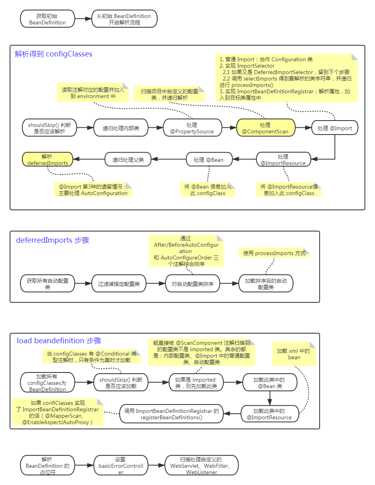

## 1 了解初始化流程好处

- 把握容器中有哪些实例
- 了解实例初始化顺序
- 项目出错的时候更容易定位到问题
- 了解spring的扩展点

## 2 初始化总流程

## 3 初始化 environment

## 4 加载 context 总流程

## 5 加载 BeanDefinition

## 6 初始化 Bean

## 参考

[Springboot 源码分析 —— 总纲](<https://blog.csdn.net/kangsa998/article/details/90111402>)

[Springboot 源码分析 —— bean 初始化流程、beanPostProcessor 用法、循环依赖](<https://blog.csdn.net/kangsa998/article/details/90056135>)

[Springboot 源码分析 —— prepareEnvironment() 解析](<https://blog.csdn.net/kangsa998/article/details/90113805>)

[Springboot 源码分析 —— refreshContext() 解析](<https://blog.csdn.net/kangsa998/article/details/90114808>)