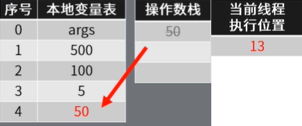

[TOC]

## 1 访问标志

```java
public class Demo1
  minor version: 0 //次版本号
  major version: 52 //主版本号
  flags: ACC_PUBLIC, ACC_SUPER //访问标志
```


## 2 常量池

- 类信息包含的静态常量，编译之后就能确定

```java
Constant pool:
   #1 = Methodref          #5.#14         // java/lang/Object."<init>":()V
   #2 = Fieldref           #15.#16        // java/lang/System.out:Ljava/io/PrintStream;
   #3 = Methodref          #17.#18        // java/io/PrintStream.println:(I)V
   #4 = Class              #19            // Demo1
   #5 = Class              #20            // java/lang/Object
   #6 = Utf8               <init>
   #7 = Utf8               ()V
   #8 = Utf8               Code
   #9 = Utf8               LineNumberTable
  #10 = Utf8               main
  #11 = Utf8               ([Ljava/lang/String;)V
  #12 = Utf8               SourceFile
  #13 = Utf8               Demo1.java
  #14 = NameAndType        #6:#7          // "<init>":()V
  #15 = Class              #21            // java/lang/System
  #16 = NameAndType        #22:#23        // out:Ljava/io/PrintStream;
  #17 = Class              #24            // java/io/PrintStream
  #18 = NameAndType        #25:#26        // println:(I)V
  #19 = Utf8               Demo1
  #20 = Utf8               java/lang/Object
  #21 = Utf8               java/lang/System
  #22 = Utf8               out
  #23 = Utf8               Ljava/io/PrintStream;
  #24 = Utf8               java/io/PrintStream
  #25 = Utf8               println
  #26 = Utf8               (I)V
```


## 3 构造方法

- 没有定义构造函数时，会有隐式的无参构造函数

```java
  public Demo1();
    descriptor: ()V
    flags: ACC_PUBLIC
    Code:
      stack=1, locals=1, args_size=1
         0: aload_0  //从局部变量0中装载引用类型值入栈
         1: invokespecial #1                  // Method java/lang/Object."<init>":()V
         4: return
      LineNumberTable:
        line 1: 0
```


## 4 main 方法

```java
//当int取值-128~127时，JVM采用bipush指令将常量压入栈中
//当int取值-32768~32767时，JVM采用sipush指令将常量压入栈中
//当int取值-2147483648~2147483647时，JVM采用ldc指令将常量压入栈中
public static void main(java.lang.String[]);
    descriptor: ([Ljava/lang/String;)V
    flags: ACC_PUBLIC, ACC_STATIC //访问控制
    Code:
      // 5 = args,x,y,a,b args 虽然没有值，但是确实是变量
      stack=3, locals=5, args_size=1 //栈深度、本地变量数、参数数量
         //前面的数字为偏移量(字节)，jvm 根据这个区分不同指令
         0: sipush        500 //500 入栈
         3: istore_1		 //将栈顶int类型值出栈，并保存到局部变量1中
         4: bipush        100 //10 入栈 (现在 10 在栈顶了)
         6: istore_2		 //将栈顶int类型值出栈，并保存到局部变量2中
         7: iload_1			//从局部变量1中装载int类型值入栈
         8: iload_2			//从局部变量2中装载int类型值入栈
         9: idiv			//将栈顶两int类型数出栈，并相除，结果入栈：栈顶为分母 500/100
        10: istore_3   		//将栈顶int类型值出栈，并保存到局部变量3中 = 5
        11: bipush        50 //50 入栈
        13: istore        4 //将栈顶int类型值出栈，并保存到局部变量indexbyte=4中
        15: getstatic     #2                  // Field java/lang/System.out:Ljava/io/PrintStream;
        18: iload_3     // 载入变量3
        19: iload         4 //载入变量4
        21: iadd			//将栈顶两int类型数相加，结果入栈
        22: invokevirtual #3                  // Method java/io/PrintStream.println:(I)V  //关键！ 开启新的栈
        25: return
      LineNumberTable:
        line 3: 0
        line 4: 4
        line 5: 7
        line 6: 11
        line 7: 15
        line 8: 25
```

## 5 main 方法栈帧变化

- 0: sipush        500
- 3: istore_1


- 4: bipush        100
- 6: istore_2


- 7: iload_1
- 8: iload_2


- 9: idiv 栈顶两个数出栈，并相除，在入栈
- 10: istore_3 将栈顶元素出栈，并保存到局部变量3中


- 11: bipush
- 13: istore



- 15: getstatic     #2  // System.out 是静态属性！将这个引用压如栈中。获取静态字段的值 
- 18: iload_3       
- 19: iload         4 //载入变量4


- 21: iadd			//将栈顶两int类型数相加，结果入栈


- **22: invokevirtual #3  开启新的栈**
  - 调用静态方法，jvm 会根据这个方法的描述创建新的栈帧
  - 方法的参数从操作数栈找那个弹出，压入新的栈帧中
  - 如果方法有返回值则将返回值压入上一个栈帧