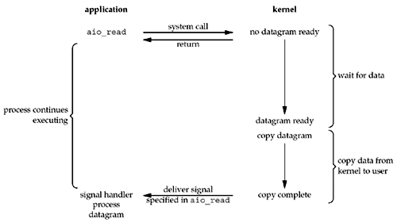

[TOC]

要谈Java的NIO, 还是先从I/O开始说起。
Unix提供了5种不同的I/O模型，分别是

- 阻塞I/O(blocking I/O)
- 非阻塞I/O(non-blocking I/O)
- I/O复用(I/O multiplexing)
- 信号驱动式I/O(signal-driven I/O)
- 异步I/O(asynchronous I/O)

一个I/O操作需要从用户态进入内核态运行,通常包括俩阶段

1. 等待数据
2. 从内核向进程复制数据

对于socket I/O而言，第一步通常是等待数据从网络中到达，到达之后会复制到内核的某个缓冲区
第二步就是从 **内核缓冲区** 复制到 **应用进程缓冲区**

## 1 阻塞I/O

默认情况下，所有的socket都是阻塞的. 如图所示

1. 应用发起recvfrom这个系统调用, 应用被阻塞
2. 内核等待数据准备好
3. 数据准备好, 内核将数据复制到应用缓冲区
4. 应用从阻塞里恢复，处理数据

这也是理解和编程起来比较简单的模型，所以计算机早期用的很多,现在在处理超大文件的时候，也依然适用于这种模型。

## 2 非阻塞I/O

- 相比于`Blocking I/O`, `Non-Blocking I/O`的**等待数据**阶段不会被阻塞，也就是说操作系统不会挂起应用, 应用

不断`轮询(polling)`内核看是否数据准备好。某次轮询发现准备好了，再直接发系统调用阻塞取数据

- 内核准备好数据之后，**下一个轮询则应用程序将阻塞**，直到 应用程序拿到内核 copy 过来的数据

`Unix网络编程`里对`轮询`的定义是:
**应用进程对非阻塞描述符循环发送系统调用，以查看某个操作是否就绪**

## 3 I/O多路复用

- IO 多路复用，在两个阶段都阻塞
- 但相比于 BIO，它能同时监听多个 IO 事件，只要一个 ready 就会去执行

在处理非常多的描述符的时候，I/O多路复用技术显得非常有用。I/O多路复用需要发送2次系统调用:

1. select或者poll, 获取可读条件, 等待描述符变成可读
2. 发起recvfrom系统调用，内核复制数据到应用。

在只有1个客户端的时候，I/O多路复用技术甚至不如阻塞I/O.因为多发了一次系统调用。
但有些常用的网络场景，如:

- 既要处理TCP,又要处理UDP
- 一个服务器处理多个服务或者多个协议
- 一个TCP服务器既要监听socket，又要处理已连接socket

这些场景下，多发的这次系统调用能带来更高的I/O处理效率，能更均匀的使用服务器时间片, 处理更多连接。
常用的方法是把I/O多路复用和非阻塞I/O结合使用，这样应用进程不需要阻塞，能处理别的业务，同时又能够处理多个I/O请求

## 4 信号驱动I/O

- 和 NIO 的区别在于，NIO 是轮询获取状态(push)，而它是被动接收状态(poll)

信号模型的步骤是:

1. 应用进程发起一个信号，告诉内核要什么文件，然后立马返回
2. 内核准备好数据
3. 应用进程收到信号发起recvfrom系统调用来阻塞取数据

信号驱动模型类似于你去一点点买奶茶，对方给你一个小票。
什么时候好了对方喊xx号(这就是信号)好了.然后你来取奶茶(recvfrom取数据)

## 5 异步I/O

步骤：

1. 应用进程发起aio_read系统调用，告诉内核要什么文件，然后立马返回
2. 内核准备好数据, copy到应用进程, 然后给应用进程发aio_read指定的信号
3. 应用进程收到信号，开始处理数据,整个过程应用进程都没有被阻塞

AIO模型是比较高效的, 异步非阻塞，从各个方面来说都是。但是编程难度比较大(和人的思维惯性相左)，代码写起来不易维护，可能未来会火吧。目前I/O多路复用已经足够用了。

## 总结

- 前四种模型的区别主要在第一阶段， 第二阶段recvfrom将数据从内核复制到应用的缓冲区期间，都会阻塞应用进程。 而异步I/O模型在两个阶段都要处理. 

- `Non-Blocking I/O`和`Signal-Driven I/O`在数据准备阶段都不会阻塞，前者要轮询内核数据是否准备好，后者是直接等待内核通知回调 
- `Asynchronous I/O`是在真正意义上的`POSIX`定义的异步io操作, 在数据准备和复制阶段都不会阻塞应用,但是编程难度大 
- `I/O Multiplexing`在数据准备阶段也会阻塞，但是可以处理更多I/O请求，也就是说加了层中间人抽象，虽然阻塞了应用进程，但是能知道多个fd可读可写,也是大名鼎鼎的`reactor模式`的基础 

